<!-- ===================== HEADER ===================== -->

<div align="center">

# Hey, I'm Nathan 👋

<a href="https://github.com/Nathanthe1dev">
  
</a>

<br>


</div>

---

## 🧠 About Me

```text
CSE (AI/ML) undergrad
⚙️ Full-stack tinkerer
🤖 AI/ML explorer
🧩 Problem solver
🛠️ Builder > spectator
```

> Turning caffeine, curiosity and questionable ideas into working software.

---

<!-- ===================== TECH STACK ===================== -->

## ⚡ Tech Stack

### Languages

<table>
  <tr>
    <td align="center">
      <a href="https://skillicons.dev/icons?i=python">
        <br>
        <sub>Python</sub>
      </a>
    </td>
    <td align="center">
      <a href="https://skillicons.dev/icons?i=cpp">
        <br>
        <sub>C++</sub>
      </a>
    </td>
    <td align="center">
      <a href="https://skillicons.dev/icons?i=java">
        <br>
        <sub>Java</sub>
      </a>
    </td>
    <td align="center">
      <a href="https://skillicons.dev/icons?i=c">
        <br>
        <sub>C</sub>
      </a>
    </td>
    <td align="center">
      <a href="https://skillicons.dev/icons?i=javascript">
        <br>
        <sub>JavaScript</sub>
      </a>
    </td>
  </tr>
</table>

### Web & Frontend

<table>
  <tr>
    <td align="center">
      <a href="https://skillicons.dev/icons?i=html">
        <br>
        <sub>HTML</sub>
      </a>
    </td>
    <td align="center">
      <a href="https://skillicons.dev/icons?i=css">
        <br>
        <sub>CSS</sub>
      </a>
    </td>
    <td align="center">
      <a href="https://skillicons.dev/icons?i=nodejs">
        <br>
        <sub>Node.js</sub>
      </a>
    </td>
  </tr>
</table>

### 3D / Creative Web

<table>
  <tr>
    <td align="center">
      <a href="https://skillicons.dev/icons?i=threejs">
        <br>
        <sub>Three.js</sub>
      </a>
    </td>
    <td align="center">
      <br>
      <sub>Canvas API</sub>
    </td>
    <td align="center">
      <br>
      <sub>Web Audio</sub>
    </td>
    <td align="center">
      <br>
      <sub>GSAP</sub>
    </td>
    <td align="center">
      <br>
      <sub>WebGL</sub>
    </td>
  </tr>
</table>

### Tools & Systems

<table>
  <tr>
    <td align="center">
      <a href="https://skillicons.dev/icons?i=git">
        <br>
        <sub>Git</sub>
      </a>
    </td>
    <td align="center">
      <a href="https://skillicons.dev/icons?i=github">
        <br>
        <sub>GitHub</sub>
      </a>
    </td>
    <td align="center">
      <a href="https://skillicons.dev/icons?i=vscode">
        <br>
        <sub>VS Code</sub>
      </a>
    </td>
    <td align="center">
      <a href="https://skillicons.dev/icons?i=linux">
        <br>
        <sub>Linux</sub>
      </a>
    </td>
    <td align="center">
      <a href="https://skillicons.dev/icons?i=vite">
        <br>
        <sub>Vite</sub>
      </a>
    </td>
  </tr>
</table>

<!--
### AI / ML

<table>
  <tr>
    <td align="center">
      <a href="https://skillicons.dev/icons?i=pytorch">
        <br>
        <sub>PyTorch</sub>
      </a>
    </td>
    <td align="center">
      <a href="https://skillicons.dev/icons?i=tensorflow">
        <br>
        <sub>TensorFlow</sub>
      </a>
    </td>
    <td align="center">
      <a href="https://skillicons.dev/icons?i=python">
        <br>
        <sub>Python</sub>
      </a>
    </td>
  </tr>
</table>

-->

---

## 🚀 Projects

> `building → breaking → debugging → shipping`

### 🛰️ ORBITAL-01 — The Last Signal

`Three.js` `JavaScript` `GSAP` `WebGL` `Vite`

> Interactive deep-space mission control with 3D flight, live telemetry, radar, missions, targeting and a command terminal.

[**Live Demo →**](https://nathanthe1dev.github.io/orbital-01/) · [**Repo →**](https://github.com/Nathanthe1dev/orbital-01)

---

<p align="center">
  <a href="https://github.com/Nathanthe1dev?tab=repositories">
    
  </a>
</p>

---

## 📊 GitHub Stats

<p align="center">
  
  
</p>

<p align="center">
  
</p>

---

<!--
## 🧩 Coding Profiles

```text
LeetCode   → building
Codeforces → building
CodeChef   → building
HackerRank → building
```

-->

## 🌐 Connect With Me

<p align="center">
<a href="https://www.linkedin.com/in/the-nathan-holt"></a>
<a href="https://mail.google.com/mail/?view=cm&fs=1&to=nathan.coding1@gmail.com"></a>
<a href="https://github.com/Nathanthe1dev"></a>
</p>

---

## 📈 Activity

<p align="center">
  <picture>
    <source media="(prefers-color-scheme: dark)" srcset="https://raw.githubusercontent.com/Nathanthe1dev/Nathanthe1dev/output/github-contribution-grid-snake-dark.svg" />
    <source media="(prefers-color-scheme: light)" srcset="https://raw.githubusercontent.com/Nathanthe1dev/Nathanthe1dev/output/github-contribution-grid-snake.svg" />
    
  </picture>
</p>

---

## `// FOOTER :: SYSTEM STATUS`

<div align="center">

```text
╭────────────────────────────────────────────────────╮
│  nathan@github:~$ ./profile --status               │
│                                                    │
│  STATUS  :: ONLINE                                 │
│  STACK   :: AI / WEB / SYSTEMS                     │
│  STATE   :: ALWAYS_LEARNING()                      │
╰────────────────────────────────────────────────────╯
```


<br><br>

### `while(alive) { learn(); build(); repeat(); }`

<sub>// end_of_file.exe</sub>

</div>
